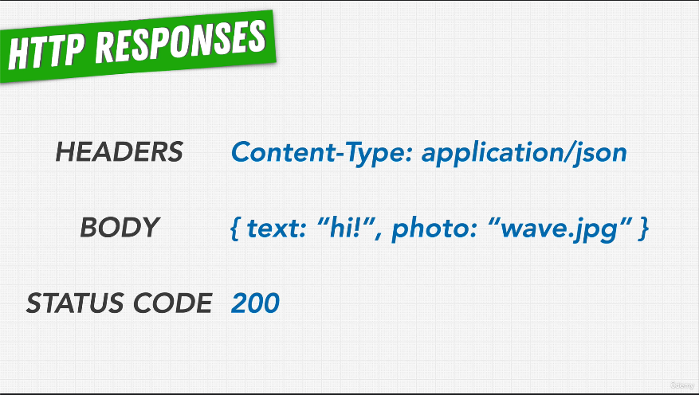

# 72. HTTP Responses

-   [HTTP response status codes](https://developer.mozilla.org/en-US/docs/Web/HTTP/Status)

---

    

---

https://github.com/odziem/http-server

---

  
 Section 7: Web Server with Node.js 

  - [Codebase: http-server](../src/s7_http-server/)

---

[Previous](./71_HTTP-Requests.md) | [Next](./73_Our-First-Webserver.md)