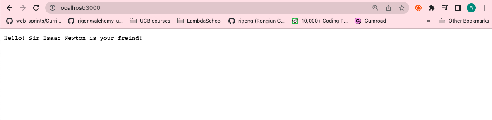
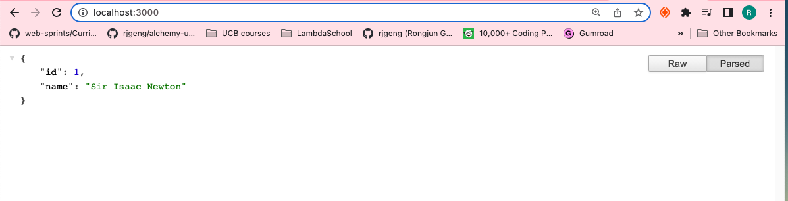

# 73. Our First Webserver

https://github.com/odziem/http-server

<details>
  <summary> example 1</summary>

  - `index.js`
  ```
const http = require('http');

PORT = 3000;

const server = http.createServer((req, res) => {
    
    res.writeHead(200, {
        'Content-Type': 'text/plain',
    });
    res.end('Hello! Sir Isaac Newton is your freind!'); 

});

server.listen(PORT, () => {
    console.log(`Listening on port ${PORT}...`)
});
  ```
  ---

  -   run `node index.js`

  ```
  Listening on port 3000...
  ```

 ---

 -  on webroswer goto `http://localhost:3000/` 

 <p align="center" >
    
</p>

</details>
<details>
  <summary> example 2</summary>

  - `index.js`
  ```
const http = require('http');

PORT = 3000;

const server = http.createServer((req, res) => {

    res.writeHead(200, {
        'Content-Type': 'application/json',
    });

    res.end(JSON.stringify({
            id: 1,
            name: 'Sir Isaac Newton'
        }));

});

server.listen(PORT, () => {
    console.log(`Listening on port ${PORT}...`)
});
  ```
  ---

  -   run `node index.js`

  ```
  Listening on port 3000...
  ```

 ---

 -  on webroswer goto `http://localhost:3000/`

 <p align="center" >
    
</p>

</details>

<details>
  <summary> Section 7: Web Server with Node.js </summary>

  - [Codebase: http-server](../src/7_http-server/)

</details>

---

[Previous](./72_HTTP-Responses.md) | [Next](./74_HTTP-APIs-and-Routing.md)