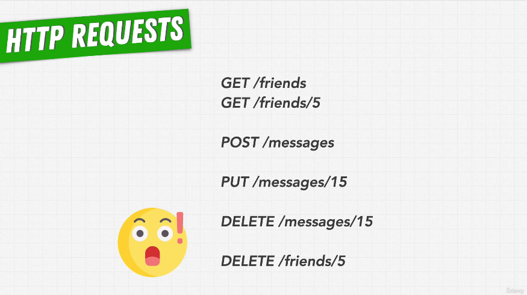
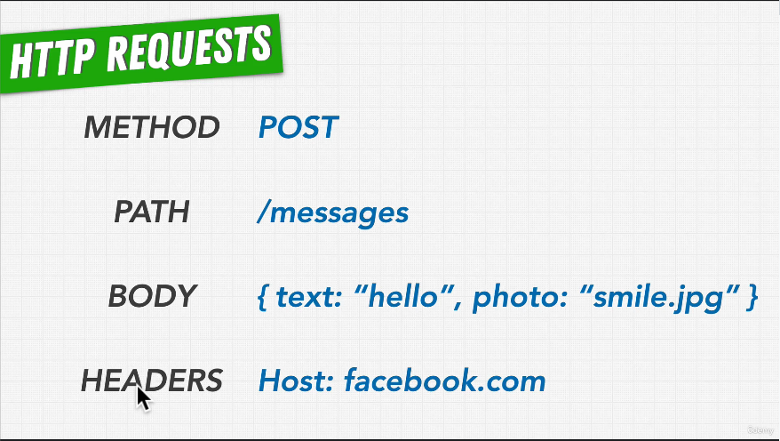
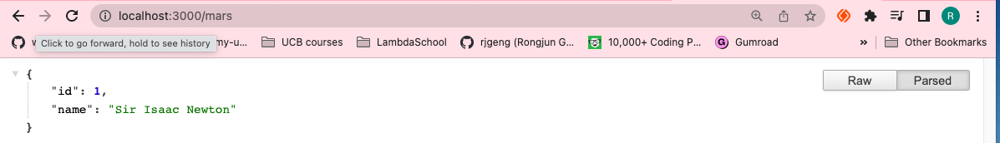
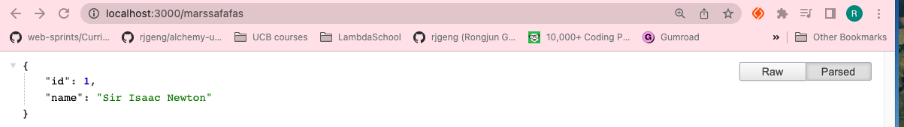
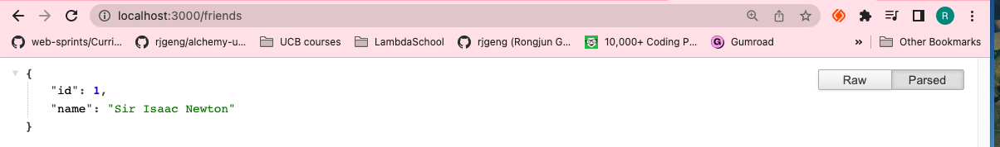
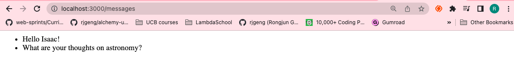
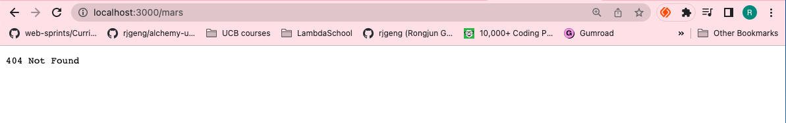

# 74. HTTP APIs and Routing

<p align="center" >
    
    
</p>

https://github.com/odziem/http-server

<details>
  <summary> example 1</summary>

  - `index.js`
  ```
const http = require('http');

PORT = 3000;

const server = http.createServer();
    
server.on('request', (req, res) => {

  res.writeHead(200, {
      'Content-Type': 'application/json',
  });

  res.end(JSON.stringify({
          id: 1,
          name: 'Sir Isaac Newton'
      }));

});

server.listen(PORT, () => {
  console.log(`Listening on port ${PORT}...`)
});
  ```
  ---

  -   run `node index.js`

  ```
  Listening on port 3000...
  ```

 ---

 -  on webroswer goto `http://localhost:3000/` or `http://localhost:3000/marssafafas`

<p align="center" >
    
    
</p>

</details>

<details>
  <summary> example 2</summary>

  - `index.js`
  ```
const http = require('http');

PORT = 3000;

const server = http.createServer();
    
server.on('request', (req, res) => {
    if (req.url === '/friends'){
        // res.writeHead(200, {
        //     'Content-Type': 'application/json',
        // });
        res.statusCode = 200;
        res.setHeader('Content-Type', 'application/json');      
        res.end(JSON.stringify({
                id: 1,
                name: 'Sir Isaac Newton'
            }));
    } else if (req.url === '/messages'){
        res.setHeader('Content-Type', 'text/html'); 
        res.write('<html>');
        res.write('<body>');
        res.write('<ul>');
        res.write('<li> Hello Isaac! </li>');
        res.write('<li> What are your thoughts on astronomy? </li>');
        res.write('</ul>');
        res.write('</body>');
        res.write('</html>');
        res.end();
    } else {
        res.statusCode = 404;
        res.setHeader('Content-Type', 'text/plain');
        res.end('404 Not Found');
    }
});

server.listen(PORT, () => {
  console.log(`Listening on port ${PORT}...`)
});
  ```
  ---

  -   run `node index.js`

  ```
  Listening on port 3000...
  ```

 ---

 -  on webroswer goto `http://localhost:3000/friends` or `http://localhost:3000/message` 

<p align="center" >
    
    
    
</p>

</details>

<details>
  <summary> Section 7: Web Server with Node.js </summary>

  - [Codebase: http-server](../src/7_http-server/)

</details>

---

[Previous](./73_Our-First-Webserver.md) | [Next](./75_Parameterized-URLs.md)