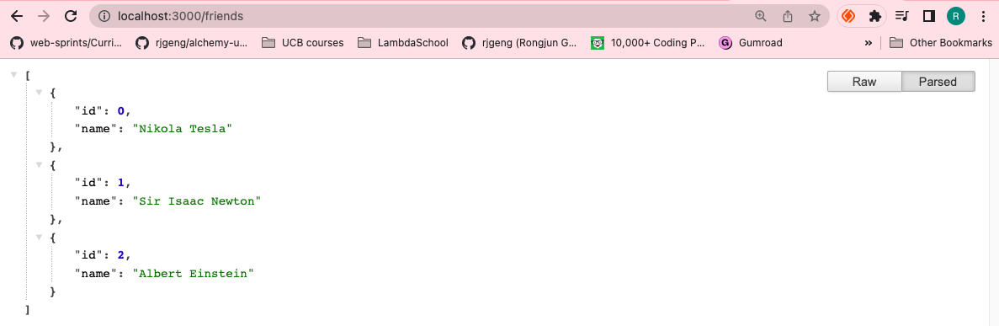

# 75. Parameterized URLs

https://github.com/odziem/http-server

<details>
  <summary> example</summary>

  - `index.js`
  ```
const http = require('http');

PORT = 3000;

const server = http.createServer();

const friends = [
    {
        id: 0,
        name: 'Nikola Tesla'
    },
    {
        id: 1,
        name: 'Sir Isaac Newton'
    },
    {
        id: 2,
        name: 'Albert Einstein'
    }
]
    
server.on('request', (req, res) => {
    const items = req.url.split('/');
    // /friends/2 => ['', 'friends', '2']
    if (items[1] === 'friends'){
        res.statusCode = 200;
        res.setHeader('Content-Type', 'application/json');      
        if (items.length === 3) {
            const friendsIndex = Number(items[2]);
            res.end(JSON.stringify(friends[friendsIndex]));
        } else {
            res.end(JSON.stringify(friends));
        }
    } else if (items[1] === 'messages'){
        res.setHeader('Content-Type', 'text/html'); 
        res.write('<html>');
        res.write('<body>');
        res.write('<ul>');
        res.write('<li> Hello Isaac! </li>');
        res.write('<li> What are your thoughts on astronomy? </li>');
        res.write('</ul>');
        res.write('</body>');
        res.write('</html>');
        res.end();
    } else {
        res.statusCode = 404;
        res.setHeader('Content-Type', 'text/plain');
        res.end('404 Not Found');
    }
});

server.listen(PORT, () => {
  console.log(`Listening on port ${PORT}...`)
});
  ```
  ---

  -   run `node index.js`

  ```
  Listening on port 3000...
  ```

 ---

 -  on webroswer goto `http://localhost:3000/friends` 

 ---

<p align="center" >
    
</p>

---

-  on webroswer goto `http://localhost:3000/friends/2` 

---

<p align="center" >
    
</p>

---

-  on webroswer goto `http://localhost:3000/friends/4` 

```
What happened???????
A: empty !!!!!!!!!!!
```
</details>


---

[Previous](./74_HTTP-APIs-and-Routing.md) | [Next](./76_Same-Origin-Policy.md)