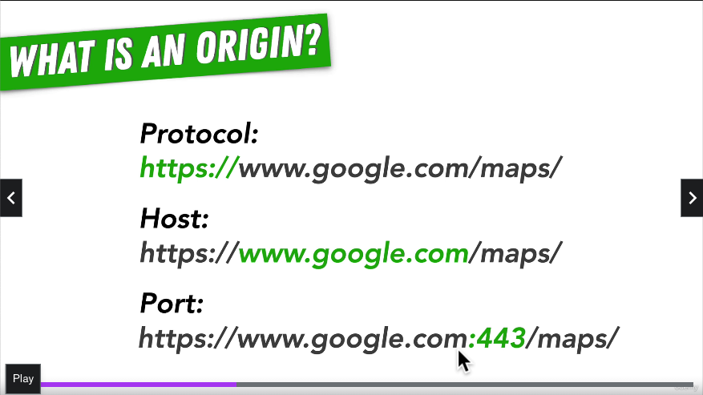

# 76. Same Origin Policy

    

-   [What is Origin?](https://developer.mozilla.org/en-US/docs/Glossary/Origin)

-   [Same Origin Policy](https://developer.mozilla.org/en-US/docs/Web/Security/Same-origin_policy)

---

https://github.com/odziem/http-server

  
 Section 7: Web Server with Node.js 

  - [Codebase: http-server](../src/s7_http-server/)

---

[Previous](./75_Parameterized-URLs.md) | [Next](./77_Exercise_Same-Origin-Policy.md)