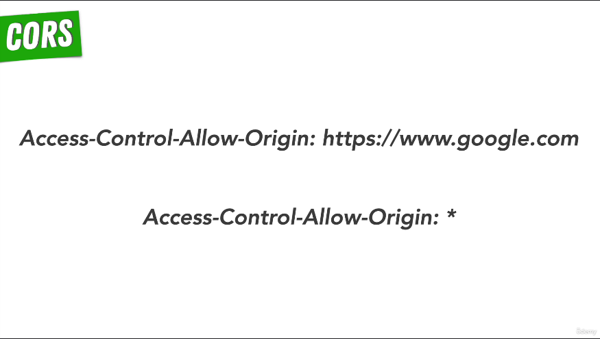

# 78. Cross Origin Resource Sharing (CORS)

    
    

-   [Cross-Origin Resource Sharing (CORS)](https://developer.mozilla.org/en-US/docs/Web/HTTP/CORS)

-   [Allow-Listing and Whitelisting](https://en.wikipedia.org/wiki/Whitelist)

https://github.com/odziem/http-server

---

[Previous](./77_Exercise_Same-Origin-Policy.md) | [Next](./79_POSTing-Data-to-the-Server.md)