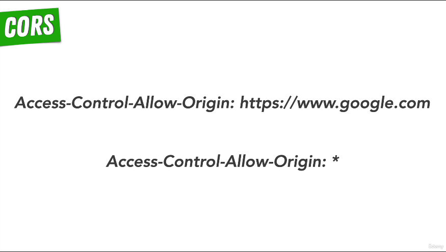
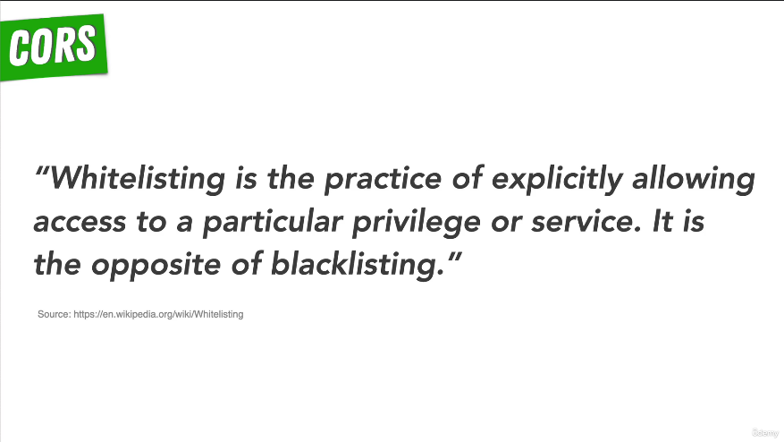
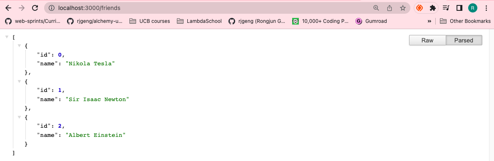

#  79. POSTing Data to the Server

<p align="center" >
    
    
</p>


-   [Cross-Origin Resource Sharing (CORS)](https://developer.mozilla.org/en-US/docs/Web/HTTP/CORS)

-   [Allow-Listing and Whitelisting](https://en.wikipedia.org/wiki/Whitelist)

https://github.com/odziem/http-server

<details>
  <summary> example</summary>

  - `index.js`
  ```

  ```
  ---

  -   run `node index.js`

  ```
  Listening on port 3000...
  ```

 ---

 -  on webroswer goto `http://localhost:3000/friends` 

 ---

<p align="center" >
    
</p>


</details>


---

[Previous](./77_Exercise_Same-Origin-Policy.md) | [Next]()