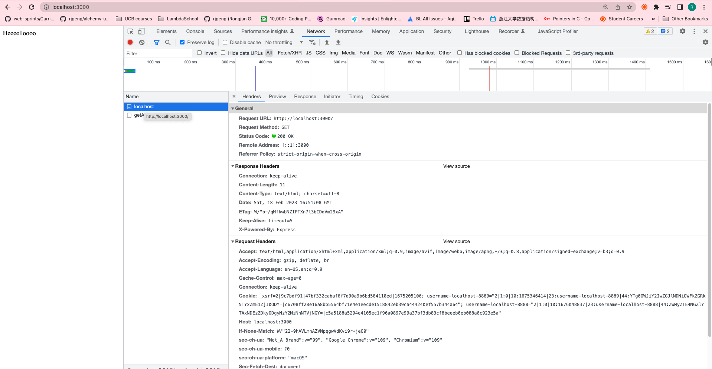
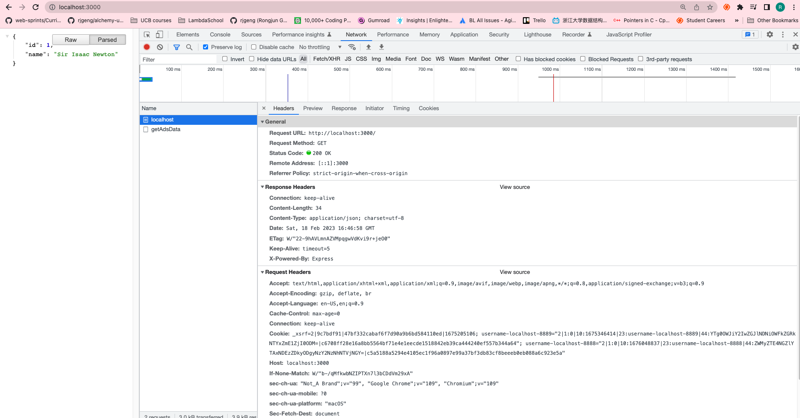

# 84. Introduction to Express

**Note 1:** `server.js` under `express` can run `npm start` without script: "start"

**Note 2:** **example 1**, `express` handle `Content-Type: text/html; charset=utf-8`

**Note 3:** **example 2**, `express` handle `Content-Type: application/json; charset=utf-8`

https://github.com/odziem/express-project


<details>
  <summary> example 1 - Content-Type: text/html; charset=utf-8 </summary>

  - `server.js` (express can run `npm start` without script: "start")
```
const express = require('express');

const app = express();

const PORT = 3000;

app.get('/', (req, res) =>[
    res.send('Heeeelloooo')
]); 

app.get('/messages', (req, res) =>[
    res.send('<ul><li>Helloo Albert!</li></ul>')
]);

app.post('/messages', (req, res) =>[
    res.send('Updating messages...')
]);

app.listen(PORT, () => {
    console.log(`Listening on ${PORT}...`);
});
```

-  on webroswer goto `http://localhost:3000/` 

 ---

<p align="center" >
    
</p> 

</details>  

<details>
  <summary> example 2 - Content-Type: application/json; charset=utf-8 </summary>

  - `server.js` (express can run `npm start` without script: "start")
```
const express = require('express');

const app = express();

const PORT = 3000;

app.get('/', (req, res) =>[
    res.send({
        id: 1,
        name: 'Sir Isaac Newton'
    })
]);

app.get('/messages', (req, res) =>[
    res.send('<ul><li>Helloo Albert!</li></ul>')
]);

app.post('/messages', (req, res) =>[
    res.send('Updating messages...')
]);

app.listen(PORT, () => {
    console.log(`Listening on ${PORT}...`);
});
```

-  on webroswer goto `http://localhost:3000/` 

 ---

<p align="center" >
    
</p> 

</details>  

<details>
  <summary> Section 8: First Express.js API </summary>

  - [Codebase: express-project](../src/8_express-project/)

</details>

---

[Previous](./83_Why-Express%3F.md) | [Next](./85_Express-vs-Next.js-vs-Koa.md)