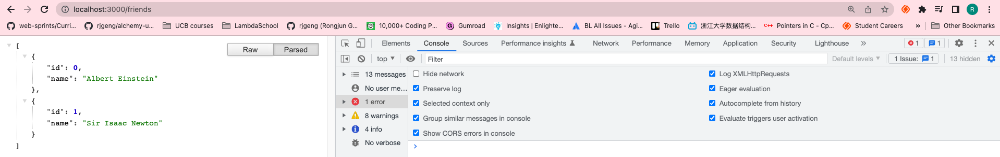

# 86. Route Parameters

https://github.com/odziem/express-project

<details>
  <summary> example </summary>

  - `server.js`
```
const express = require('express');

const app = express();

const PORT = 3000;

const friends = [
    {
        id: 0,
        name: 'Albert Einstein'
    },
    {
        id: 1,
        name: 'Sir Isaac Newton'
    }
];

app.get('/friends', (req, res) =>{
    res.json(friends);
}); 

app.get('/friends/:friendId', (req, res) =>{
    const friendId = Number(req.params.friendId);
    const friend = friends[friendId];
    if (friend) {
        res.status(200).json(friend);
    } else {
        res.status(404).json({
            error: "Friend does not exist"
        });
    }
}); 

app.get('/messages', (req, res) =>{
    res.send('<ul><li>Helloo Albert!</li></ul>')
});

app.post('/messages', (req, res) =>{
    res.send('Updating messages...')
});

app.listen(PORT, () => {
    console.log(`Listening on ${PORT}...`);
});  
``` 

---

-   run `npm start` 

- go to `http://localhost:3000/`, `http://localhost:3000/friends`, `http://localhost:3000/friends/0`, `http://localhost:3000/friends/1`, `http://localhost:3000/friends/2`

---

<p align="center" >
    
</p> 

---

<p align="center" >
    
</p> 

---

<p align="center" >
    
</p> 

---

<p align="center" >
    
</p> 

---

<p align="center" >
    
</p> 

</details>  

<details>
  <summary> Section 8: First Express.js API </summary>

  - [Codebase: express-project](../src/s8_express-project/)

</details>

---

[Previous](./85_Express-vs-Next.js-vs-Koa.md) | [Next](./87_Postman-and-Insomnia.md)