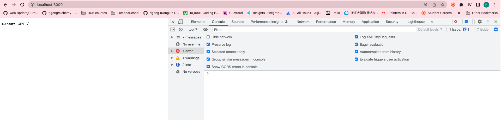
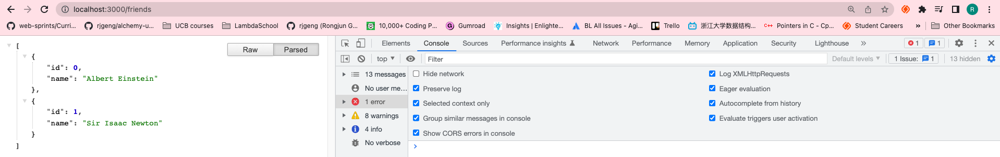
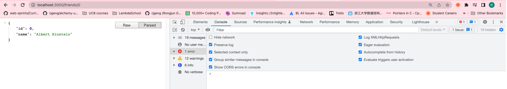
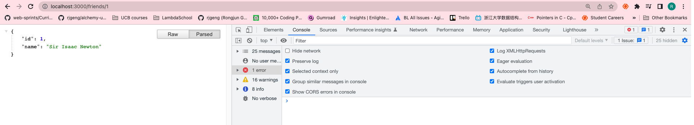
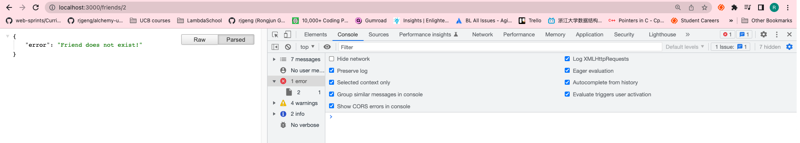

# 87. Postman and Insomnia


https://github.com/odziem/express-project

<details>
  <summary> example </summary>

  - `server.js`
    ```

    ``` 
---

-   run `npm start` 

- go to `http://localhost:3000/`, `http://localhost:3000/friends`, `http://localhost:3000/friends/0`, `http://localhost:3000/friends/1`, `http://localhost:3000/friends/2`

---

<p align="center" >
    
</p> 
---

<p align="center" >
    
</p> 

---

<p align="center" >
    
</p> 

---

<p align="center" >
    
</p> 

---

<p align="center" >
    
</p> 

</details>  

<details>
  <summary> Section 8: First Express.js API </summary>

  - [Codebase: express-project](../src/8_express-project/)

</details>

---

[Previous](./85_Express-vs-Next.js-vs-Koa.md) | [Next]()