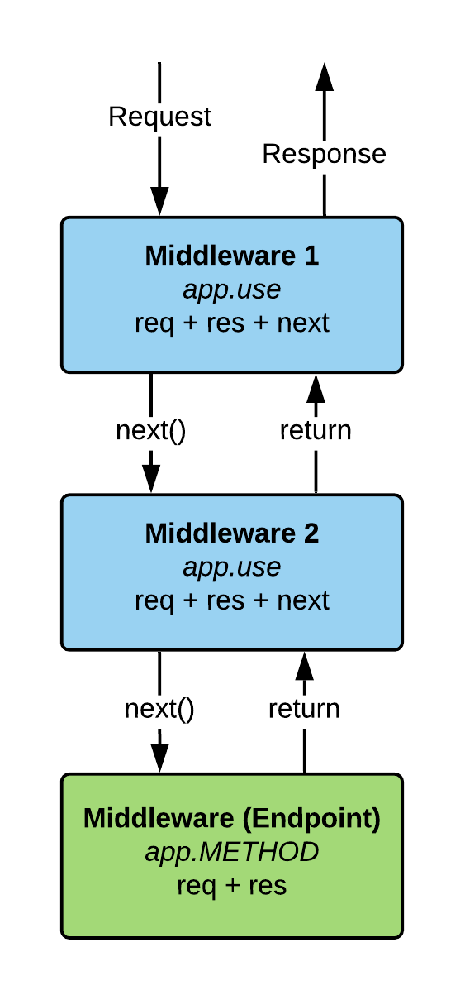

# 89. Middleware

<p align="center" >
    
</p> 

---

https://github.com/odziem/express-project

<details>
  <summary> example </summary>

  - `server.js`
    ```

    ``` 
---

-   run `npm run watch` 

-   go to `http://localhost:3000/`

---

<p align="center" >
    
</p> 


</details>  

<details>
  <summary> Section 8: First Express.js API </summary>

  - [Codebase: express-project](../src/8_express-project/)

</details>

---

[Previous](./88_Development-Dependencies.md) | [Next]()