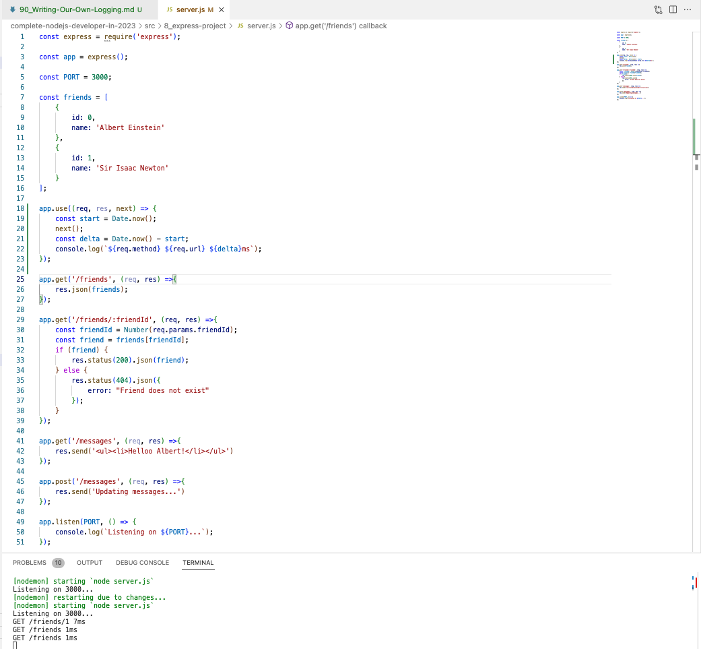

# 90. Writing Our Own Logging


https://github.com/odziem/express-project

<details>
  <summary> example </summary>

  - `server.js`
```
const express = require('express');

const app = express();

const PORT = 3000;

const friends = [
    {
        id: 0,
        name: 'Albert Einstein'
    },
    {
        id: 1,
        name: 'Sir Isaac Newton'
    }
];

app.use((req, res, next) => {
    const start = Date.now();
    next();
    const delta = Date.now() - start;
    console.log(`${req.method} ${req.url} ${delta}ms`);
});

app.get('/friends', (req, res) =>{
    res.json(friends);
}); 

app.get('/friends/:friendId', (req, res) =>{
    const friendId = Number(req.params.friendId);
    const friend = friends[friendId];
    if (friend) {
        res.status(200).json(friend);
    } else {
        res.status(404).json({
            error: "Friend does not exist"
        });
    }
}); 

app.get('/messages', (req, res) =>{
    res.send('<ul><li>Helloo Albert!</li></ul>')
});

app.post('/messages', (req, res) =>{
    res.send('Updating messages...')
});

app.listen(PORT, () => {
    console.log(`Listening on ${PORT}...`);
});
``` 
---

-   run `npm run watch` 

---

<p align="center" >
    
</p> 


</details>  

<details>
  <summary> Section 8: First Express.js API </summary>

  - [Codebase: express-project](../src/s8_express-project/)

</details>

---

[Previous](./89_Middleware.md) | [Next](./91_POST-Requests-in-Express.md)