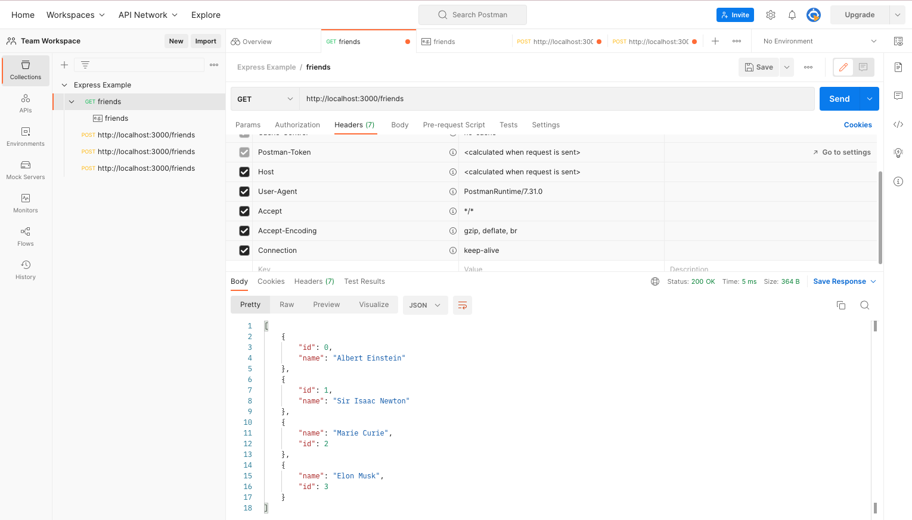
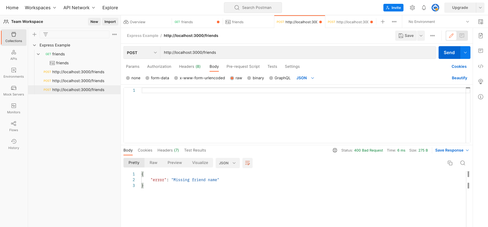

# 91. POST Requests in Express

https://github.com/odziem/express-project

<details>
  <summary> example </summary>

  - `server.js`
```

``` 
---

-   run `npm run watch` 

-  `postman` 
---

<p align="center" >
    
</p> 

---

<p align="center" >
    
</p> 

---

<p align="center" >
    
</p> 


</details>  

<details>
  <summary> Section 8: First Express.js API </summary>

  - [Codebase: express-project](../src/8_express-project/)

</details>

---

[Previous](./89_Middleware.md) | [Next](./91_POST-Requests-in-Express.md)