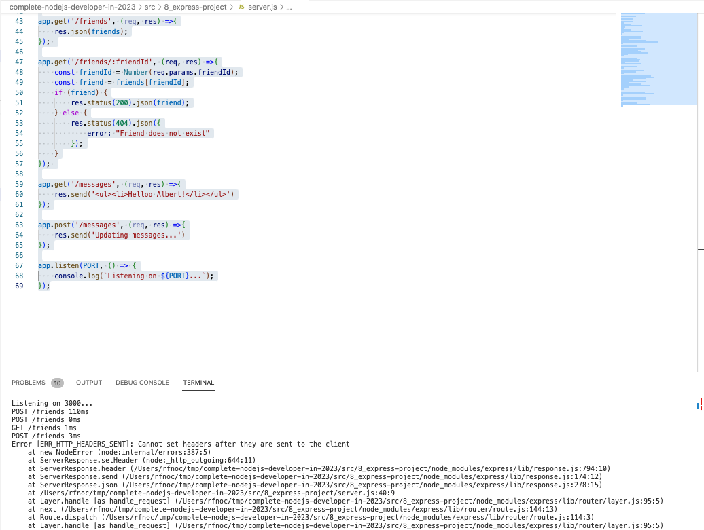

# 92. Model View Controller (MVC)

-   [Model View Controller](https://en.wikipedia.org/wiki/Model%E2%80%93view%E2%80%93controller)

https://github.com/odziem/express-project

<details>
  <summary> example </summary>

  - `server.js`
```

``` 
---

-   run `npm run watch` 

<p align="center" >
    
</p> 

-  `postman` 

---

<p align="center" >
    
</p> 

</details>  

<details>
  <summary> Section 8: First Express.js API </summary>

  - [Codebase: express-project](../src/8_express-project/)

</details>

---

[Previous](./91_POST-Requests-in-Express.md) | [Next]()