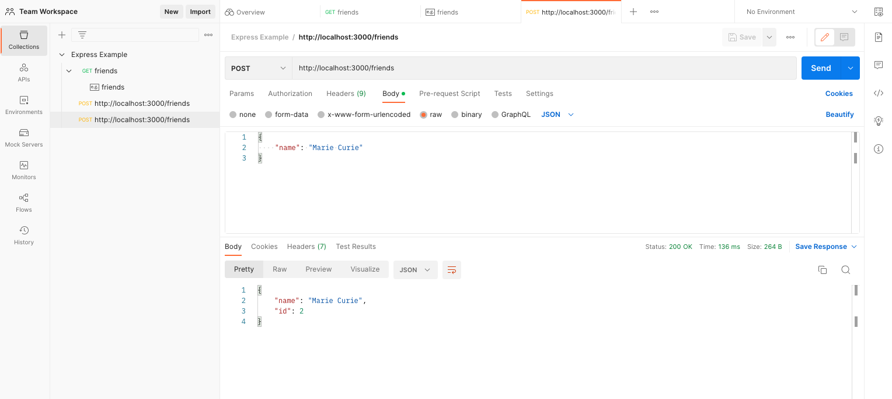

# 93. Model View Controller in Express

https://github.com/odziem/express-project

<details>
  <summary> example </summary>

  - `server.js`
```
const express = require('express');

const friendsController = require('./controllers/friends.controller');
const messagesController = require('./controllers/messages.controller');

const app = express();

const PORT = 3000;

app.use((req, res, next) => {
    const start = Date.now();
    next();
    const delta = Date.now() - start;
    console.log(`${req.method} ${req.url} ${delta}ms`);
});

app.use(express.json());

app.post('/friends', friendsController.postFriend); 
app.get('/friends', friendsController.getFriends); 
app.get('/friends/:friendId', friendsController.getFriend); 

app.get('/messages', messagesController.getMessages);
app.post('/messages', messagesController.postMessages);

app.listen(PORT, () => {
    console.log(`Listening on ${PORT}...`);
});
``` 

-   `model/friends.model.js`
```
const friends = [
    {
        id: 0,
        name: 'Albert Einstein'
    },
    {
        id: 1,
        name: 'Sir Isaac Newton'
    }
];

module.exports = friends
```

-   `controller/friends.controller.js`
```
const model = require('../models/friends.model')

function postFriend(req, res) {
    if (!req.body.name) {
        return res.status(400).json({
        //res.status(400).json({
            error: "Missing friend name"
        });
    };
    const newFriends = {
        name: req.body.name,
        id: model.length
    };
    model.push(newFriends);

    res.json(newFriends)
}

function getFriends (req, res) {
    res.json(model);
}

function getFriend (req, res) {
    const friendId = Number(req.params.friendId);
    const friend = model[friendId];
    if (friend) {
        res.status(200).json(friend);
    } else {
        res.status(404).json({
            error: "Friend does not exist"
        });
    }
}

module.exports = {
    getFriends,
    getFriend,
    postFriend
}
```

-   `controller/messages.controller.js`
```
function getMessages (req, res)  {
    res.send('<ul><li>Helloo Albert!</li></ul>');
}

function postMessages(req, res) {
    console.log('Updating messages...');
}

module.exports = {
    getMessages,
    postMessages
}
```

---

-   run `npm run watch` 

-  `postman` 

---

<p align="center" >
    
</p> 

---

<p align="center" >
    
</p> 

---

<p align="center" >
    
</p> 

</details>  

<details>
  <summary> Section 8: First Express.js API </summary>

  - [Codebase: express-project](../src/8_express-project/)

</details>

---

[Previous](./92_Model-View-Controller-(MVC).md) | [Next](./94_Express-Routers.md)

