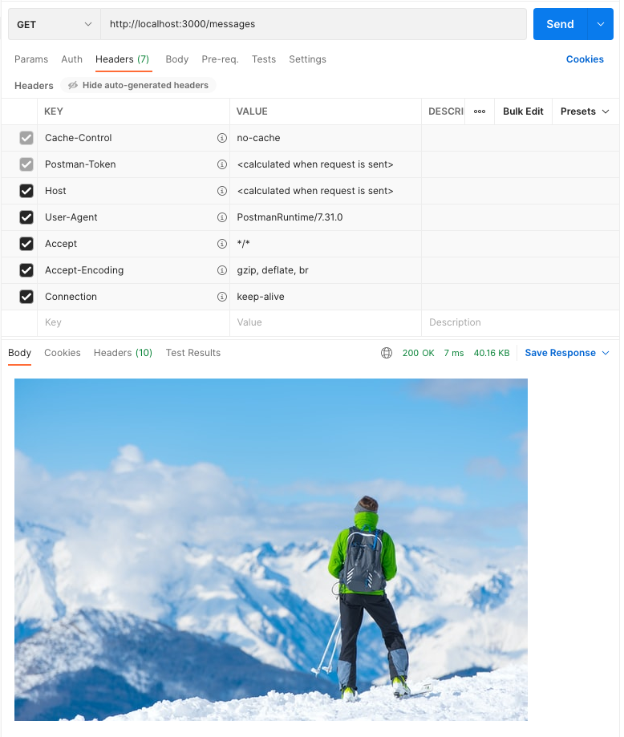
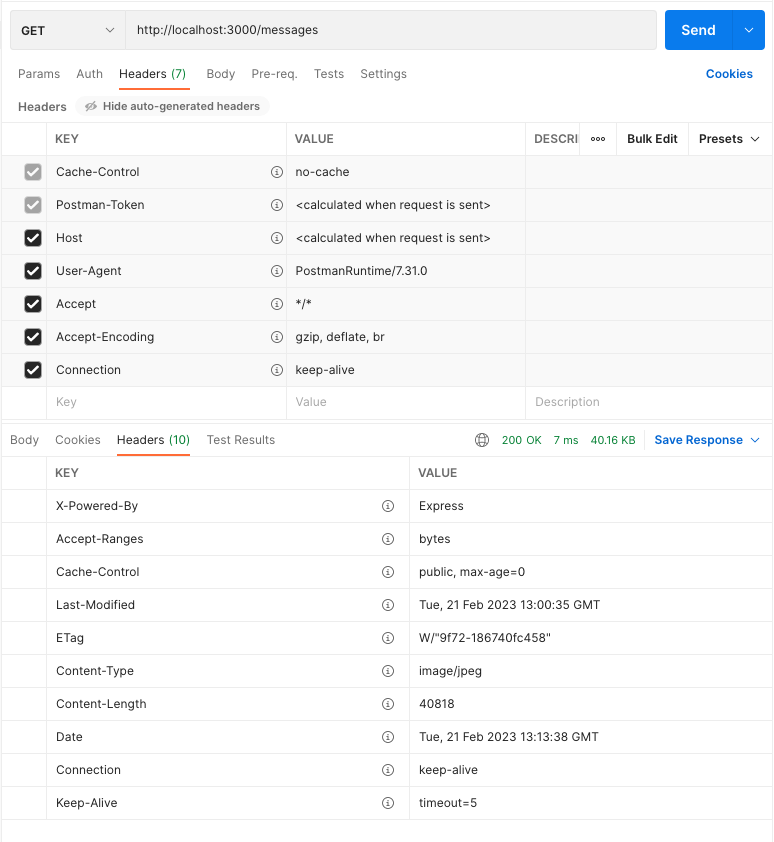

# 97. Sending Files

<p align="center" >
    
</p> 

https://github.com/odziem/express-project

<details>
  <summary> example </summary>

  - `server.js`
```
const express = require('express');

const friendsRouter = require('./routes/friends.router.js');
const messagesRouter = require('./routes/messages.router.js');

const app = express();

const PORT = 3000;

app.use((req, res, next) => {
    const start = Date.now();
    next();
    const delta = Date.now() - start;
    console.log(`${req.method} ${req.baseUrl} ${req.url} ${delta}ms`);
});

app.use(express.json());

app.use('/friends', friendsRouter);
app.use('/messages', messagesRouter);

app.listen(PORT, () => {
    console.log(`Listening on ${PORT}...`);
});
``` 

-   `model/friends.model.js`
```
const friends = [
    {
        id: 0,
        name: 'Albert Einstein'
    },
    {
        id: 1,
        name: 'Sir Isaac Newton'
    }
];

module.exports = friends
```

-   `controller/friends.controller.js`
```
const model = require('../models/friends.model')

function postFriend(req, res) {
    if (!req.body.name) {
        return res.status(400).json({
        //res.status(400).json({
            error: "Missing friend name"
        });
    };
    const newFriends = {
        name: req.body.name,
        id: model.length
    };
    model.push(newFriends);

    res.json(newFriends)
}

function getFriends (req, res) {
    res.json(model);
}

function getFriend (req, res) {
    const friendId = Number(req.params.friendId);
    const friend = model[friendId];
    if (friend) {
        res.status(200).json(friend);
    } else {
        res.status(404).json({
            error: "Friend does not exist"
        });
    }
}

module.exports = {
    getFriends,
    getFriend,
    postFriend
}
```

-   `controller/messages.controller.js`
```
const path = require('path');

function getMessages (req, res)  {
    res.sendFile(path.join(__dirname, '..', 'public', 'skimountain.jpeg'));
    // res.send('<ul><li>Helloo Albert!</li></ul>');
}

function postMessages(req, res) {
    console.log('Updating messages...');
}

module.exports = {
    getMessages,
    postMessages
}
```

-   `routes/friends.router.js`
```
const express = require('express');

const friendsController = require('../controllers/friends.controller');

const friendsRouter = express.Router();

friendsRouter.use((req, res, next) => {
    console.log('ip address:', req.ip);
    next();
});
friendsRouter.post('/', friendsController.postFriend); 
friendsRouter.get('/', friendsController.getFriends); 
friendsRouter.get('/:friendId', friendsController.getFriend); 

module.exports = friendsRouter;
```

-   `routes/messages.router.js`
```
const express = require('express');

const messagesController = require('../controllers/messages.controller');

const messagesRouter = express.Router();

messagesRouter.get('/', messagesController.getMessages);
messagesRouter.post('/', messagesController.postMessages);

module.exports = messagesRouter;

```

---

-   run `npm run watch` 

-  `postman` 


<p align="center" >
    
</p> 

---

<p align="center" >
    
</p> 

---

-  `http://localhost:3000/messages`

<p align="center" >
    
</p> 

</details>  

<details>
  <summary> Section 8: First Express.js API </summary>

  - [Codebase: express-project](../src/8_express-project/)

</details>

---

[Previous](./96_Create-Read-Update-and-Delete-(CRUD).md) | [Next]()