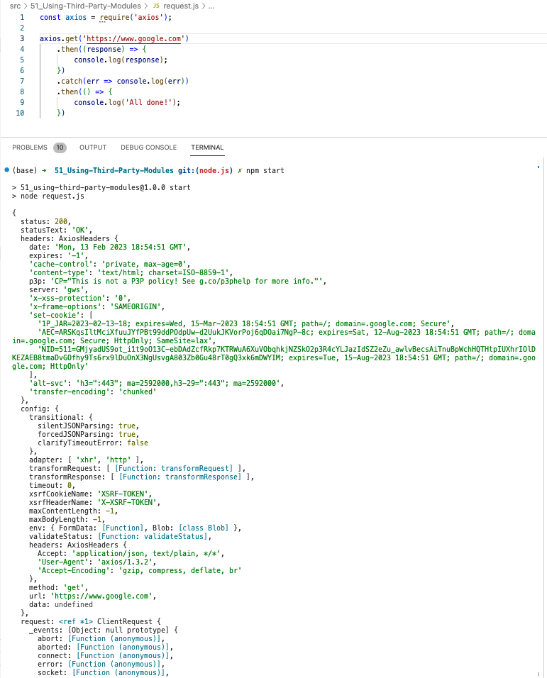

# SRC: 51. Using Third Party Modules

-   [Axios NPM Package Overview](https://www.npmjs.com/package/axios)

  
 result capture 

-   run `npm start`

</a>
 

---

[Back to content - 51. Using Third Party Modules](../../contents/51_Using-Third-Party-Modules.md) 