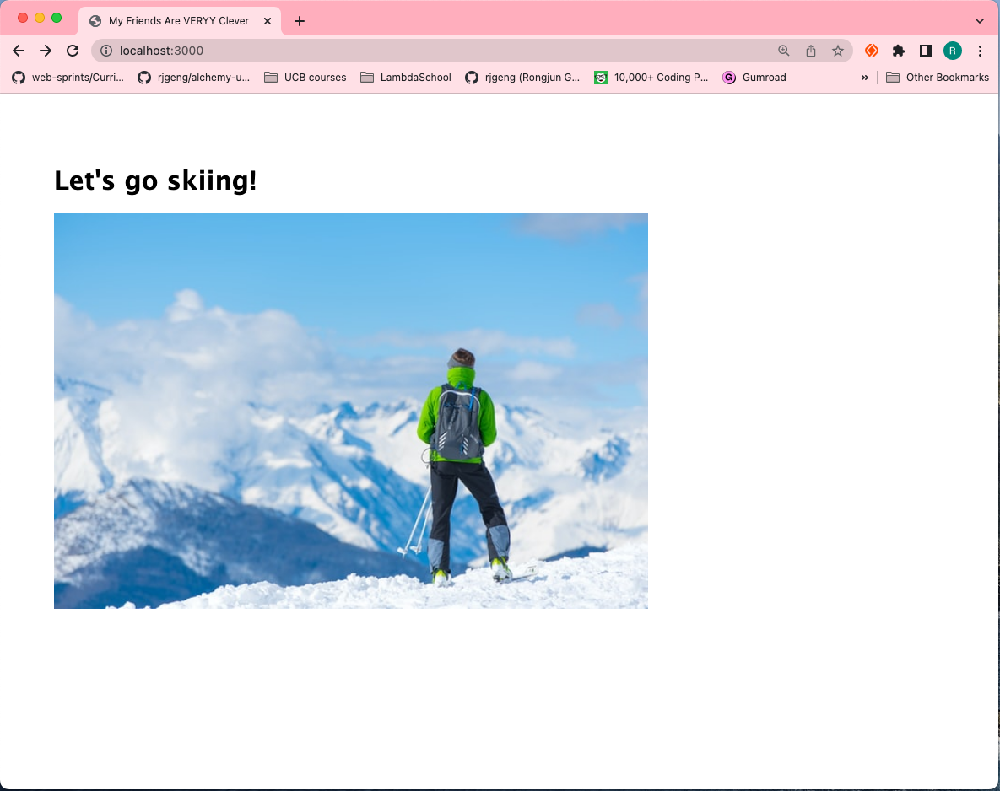
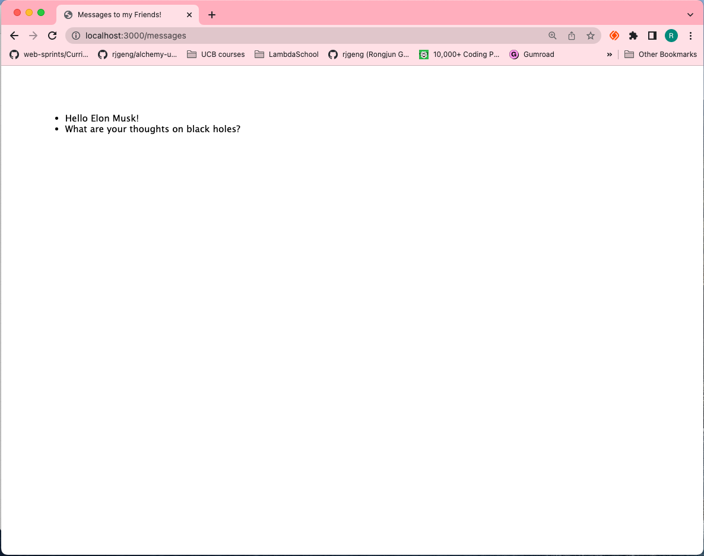

#   Section 9: NASA Project

## NASA Dashboard Front End Setup

  - copy unzipped files into `client` folder

  - install package `npm install` 

  - create gitignore file `npx gitignore node` 

  - install CORS `npm i cors`

  - run client `npm start`

  - install csv-parse `npm i csv-parse`

<details>
  <summary> Capture - FrontEnd Setup </summary>  

  <p align="center" >
    
    
    
</p> 

</details>

## NASA API Server Setup 

- install package.json and create .gitignore file 
  ```
  npm init -y 
  npx gitignore node
  ````

  - install express `npm i express` 
 
  - install nodemon `npm i nodemon --save-dev`

  - add script: `"watch": "nodemon server.js",` in `package.json`


<details>
  <summary> Capture - Server Setup </summary>

-   run `npm run watch` 

-  `http://localhost:3000/`

<p align="center" >
    
    
</p> 

</details>

---

[Section 9: NASA Project](../../contents/Section-9_NASA-Project.md) 